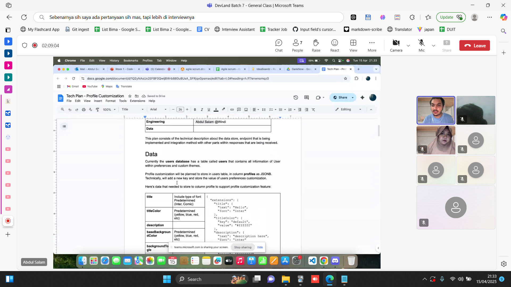

# 🌟 Week 1 - Rangkuman dan Aktivitas 🌟

## 🔍 **Rangkuman Materi** 📚

Minggu pertama ini kita ngebahas banyak hal baru yang seru banget! Dari yang dasar-dasar sampai konsep-konsep penting di dunia pemrograman. Berikut adalah materi yang kita pelajari:

### 1. **GitHub dan Git** 🖥️

Kita mulai dari **Git** dan **GitHub**, dua tools keren buat ngatur perubahan kode dan kerja bareng tim. **Git** itu tools buat ngelacak semua perubahan kode kita. Jadi, kalau misalnya ada kesalahan atau butuh balikin kode ke versi sebelumnya, gampang banget! Nah, **GitHub** itu tempat nyimpen semua project kita di cloud biar bisa akses kapan aja dan kolaborasi sama orang lain.

### 2. **Merge Conflict** ⚠️

Pernah nggak sih, kerja bareng di Git tapi tiba-tiba ada **merge conflict**? Nah, itu terjadi kalo ada dua orang yang ngubah bagian yang sama dari kode yang sama. Jadi, kita belajar cara menyelesaikan masalah itu dengan ngebenerin konflik di file dan ngegabungin perubahan yang ada.

### 3. **Push dan Deploy** 🚀

Setelah ngoding, kita nggak cuma selesai gitu aja. Kita harus **push** hasil kerja kita ke GitHub, biar orang lain bisa lihat dan ngerjain bareng. Terus, kita juga belajar cara **deploy** aplikasi ke server atau platform kayak **Heroku** atau **Netlify**, supaya aplikasi yang kita buat bisa langsung dipake orang lain di internet!

### 4. **Agile dan Scrum** 🌀

Agile itu metodologi yang ngajarin kita buat kerja dengan cara yang fleksibel dan iteratif. Jadi, kita nggak cuma ngoding tanpa liat feedback, tapi terus ngebenerin dan nge-evaluasi. Di dalam Agile, ada framework namanya **Scrum** yang ngatur peran-peran dalam tim, kayak **Scrum Master** (yang ngatur workflow), **Product Owner** (yang ngejaga agar tim fokus ke goal yang bener), dan **Development Team** (yang ngoding).

### 5. **Backend, Frontend, dan Fullstack** 💻

Buat yang penasaran, **Frontend** itu yang kita lihat di website atau aplikasi (tampilan interface-nya), sedangkan **Backend** itu yang nggak kelihatan tapi ngejalanin logika dan nyimpen data di database. Nah, kalau **Fullstack** itu orang yang ngerti dua-duanya, baik frontend dan backend, jadi bisa ngoding dari depan sampai belakang aplikasi!

### 6. **SDLC (Software Development Life Cycle)** 🔄

Ini adalah proses dari awal sampe akhir dalam pembuatan aplikasi. SDLC mencakup **planning** (rencanain project), **design** (desain aplikasi), **development** (ngoding), **testing** (ujicoba aplikasi), **deployment** (deploy aplikasi ke server), dan **maintenance** (perawatan aplikasi setelah rilis).

---

## 📸 **Bukti Kegiatan** 📸

Cek folder **`screenshoot/`** untuk bukti kehadiran dan aktivitas seru yang udah kita jalanin selama minggu pertama ini!

Berikut adalah gambar bukti kehadiran kita! 🎉

---

Terima kasih udah ikut belajar bareng minggu ini! Semoga semua materi yang dipelajari bermanfaat dan kita bisa lanjut ke materi-materi seru lainnya di minggu-minggu selanjutnya! 😎💻

#LetsGo #Week1Done #CodingTime
