# 📸 Visual Pembelajaran OOP dan Konversi Suhu

## 1. Diagram Konsep OOP

## 2. Alur Program

## 3. Hubungan Konversi Suhu

```mermaid
graph LR
    A((Celsius)) -->|× 9/5 + 32| B((Fahrenheit))
    A -->|× 4/5| C((Reamur))
    A -->|+ 273.15| D((Kelvin))

    style A fill:#ff9999
    style B fill:#99ff99
    style C fill:#9999ff
    style D fill:#ffff99
```

## 4. Mindmap OOP

## 5. Mindmap Konversi Suhu

```mermaid
mindmap
  root((Konversi))
    (Celsius)
        [Suhu dasar]
        [0° = Air beku]
        [100° = Air mendidih]
    (Fahrenheit)
        [C × 9/5 + 32]
        [32° = Air beku]
        [212° = Air mendidih]
    (Reamur)
        [C × 4/5]
        [0° = Air beku]
        [80° = Air mendidih]
    (Kelvin)
        [C + 273.15]
        [273.15K = Air beku]
        [373.15K = Air mendidih]
```

## 📝 Catatan

Diagram-diagram di atas menjelaskan:

1. Struktur class dan alur program konversi suhu
2. Hubungan dan rumus konversi antar satuan suhu
3. Konsep OOP dengan mindmap yang mudah dipahami
4. Detail setiap satuan suhu dan titik-titik pentingnya

Kalau ada yang mau ditanyakan, langsung tanya ya! 😊
