# 🔄 Alur OOP dan Konversi Suhu

## 1. Diagram Konsep OOP

## 2. Alur Program

## 3. Hubungan Antar Suhu

```mermaid
graph LR
    A((Celsius)) -->|× 9/5 + 32| B((Fahrenheit))
    A -->|× 4/5| C((Reamur))
    A -->|+ 273.15| D((Kelvin))

    style A fill:#ff9999
    style B fill:#99ff99
    style C fill:#9999ff
    style D fill:#ffff99
```

## 4. Cara Kerja OOP

Nah, dari diagram-diagram di atas, kita bisa lihat:

1. Bagaimana struktur class KonversiSuhu
2. Alur program dari mulai sampai selesai
3. Rumus-rumus konversi antar satuan suhu
4. Konsep dasar OOP yang kita pake

Keren kan? 😎
