# 🧠 Mindmap OOP dan Konversi Suhu

## Mindmap Konsep OOP

## Mindmap Konversi Suhu

```mermaid
mindmap
  root((Konversi))
    (Celsius)
        [Suhu dasar]
        [0° = Air beku]
        [100° = Air mendidih]
    (Fahrenheit)
        [C × 9/5 + 32]
        [32° = Air beku]
        [212° = Air mendidih]
    (Reamur)
        [C × 4/5]
        [0° = Air beku]
        [80° = Air mendidih]
    (Kelvin)
        [C + 273.15]
        [273.15K = Air beku]
        [373.15K = Air mendidih]
```

Mindmap ini membantu kita memahami:

1. Konsep utama dalam OOP
2. Hubungan antar konsep
3. Cara kerja konversi suhu
4. Titik-titik penting dalam skala suhu

Bisa digunakan sebagai referensi cepat saat belajar! 📚
