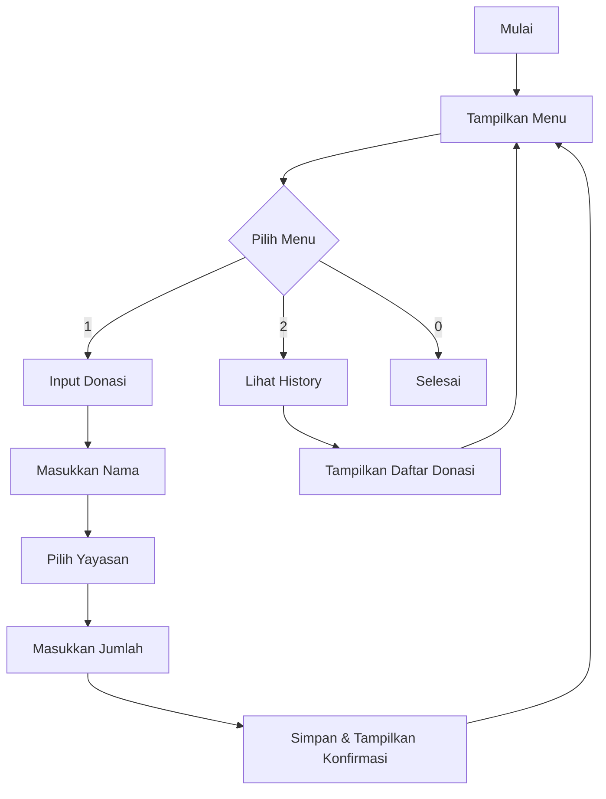

# 🎁 Program Donasi Sederhana

Halo teman-teman! Ini adalah program donasi sederhana yang dibuat pake Java. Kamu bisa:

1. Input donasi ke beberapa yayasan
2. Lihat daftar donasi yang udah masuk

## 🚀 Cara Jalanin Program

⚠️ **PENTING**: Program ini gak bisa dijalanin pake tombol Run Code di VSCode!

Ikuti langkah ini ya:

1. **Buka Terminal/Command Prompt**

   - Di VSCode: Klik menu `Terminal` terus pilih `New Terminal`
   - Atau buka Command Prompt/Terminal biasa

2. **Masuk ke Folder Program**

   ```bash
   cd week-3/praktik
   ```

3. **Compile dulu programnya**

   ```bash
   javac DonationSystem.java
   ```

4. **Jalanin program**
   ```bash
   java DonationSystem
   ```

## 📱 Cara Pake Program

1. Nanti akan muncul pilihan menu:

   - Ketik `1` kalo mau donasi
   - Ketik `2` kalo mau lihat daftar donasi
   - Ketik `0` kalo mau keluar

2. Kalo pilih donasi:
   - Masukin nama kamu
   - Pilih yayasan (A/B/C)
   - Masukin jumlah donasi

## 🔄 Alur Program



## 📦 Cara Program Nyimpan Data

Program ini nyimpen data pake array sederhana:

- Daftar nama yang donasi
- Jumlah donasi dari tiap orang
- Tanggal donasi

Data ini cuma kesimpan selama program jalan aja ya!

## 💡 Tips Pake Program

1. **Pastikan:**

   - Jalanin lewat terminal/command prompt
   - JANGAN pake extension Run Code

2. **Waktu Input:**

   - Pilih kode yang bener (A/B/C)
   - Masukin angka aja buat jumlah donasi
   - Gak usah pake Rp atau titik

3. **Kalo Error:**
   - Cek kode yayasan udah bener belum
   - Cek jumlah donasi udah bener belum (angka doang)
   - Coba jalanin ulang programnya

Selamat mencoba! 🎉
