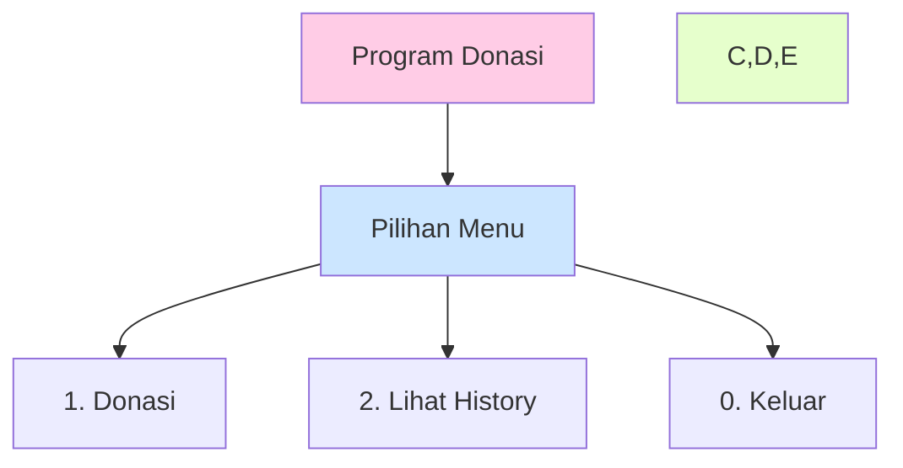
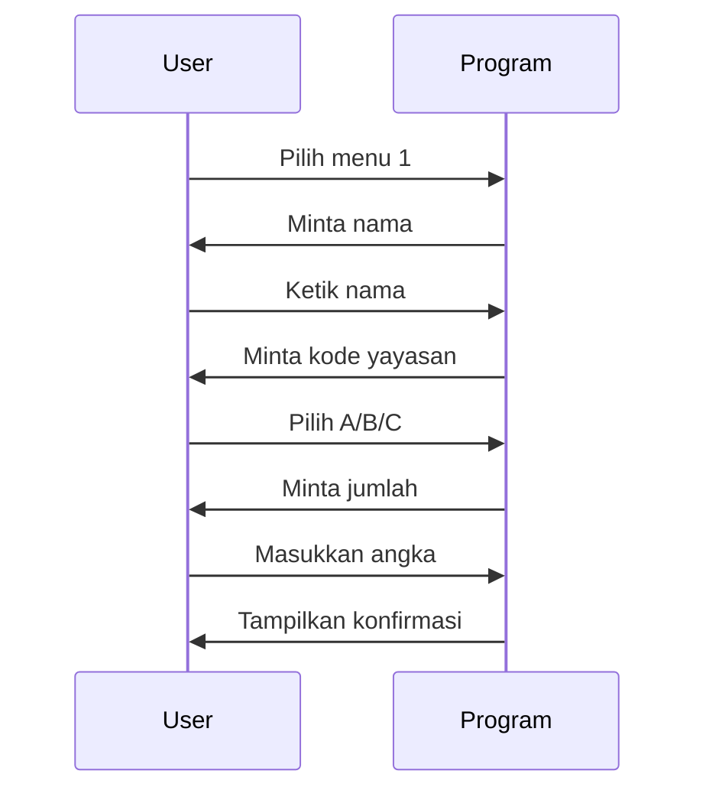

# 📸 Contoh Program Donasi

## 1. Tampilan Menu Utama



## 2. Cara Input Donasi



## 3. Contoh Tampilan Program

```
==== CONSOLE DONATION SYSTEM ====
Daftar Philanthropy:
[A] A Hope Foundation
[B] Bright Future Fund
[C] Care & Share Org

1. Donasi
2. Lihat History
0. Keluar

Pilih menu (0 untuk keluar): 1
Nama Anda    : Budi
Kode Phil.   : A
Jumlah Rp    : 50000
✔ Terima kasih, Budi!
Donasi Rp50.000 ke A Hope Foundation tercatat.
```

## 4. Contoh History Donasi

```
==== HISTORY DONASI: A HOPE FOUNDATION ====
1  Budi         Rp50.000    2025-05-04
2  Ani          Rp75.000    2025-05-04

==== HISTORY DONASI: BRIGHT FUTURE FUND ====
1  Citra        Rp100.000   2025-05-04
```

## 💭 Yang Perlu Diingat

1. **Input yang Benar:**

   - Nama: bebas
   - Kode: A atau B atau C
   - Jumlah: angka saja

2. **Format Tampilan:**
   - Jumlah donasi pake Rp
   - Ada tanggal donasi
   - Tersusun rapi per yayasan

Program ini dibuat sesimpel mungkin biar gampang dipake! 😊
