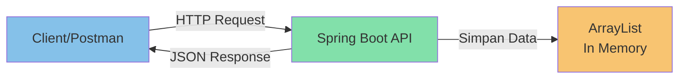
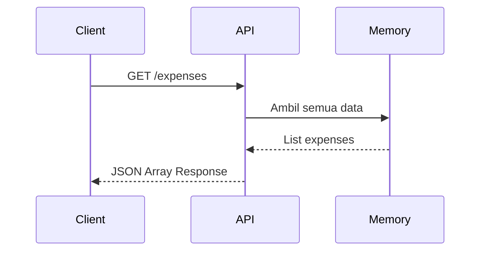
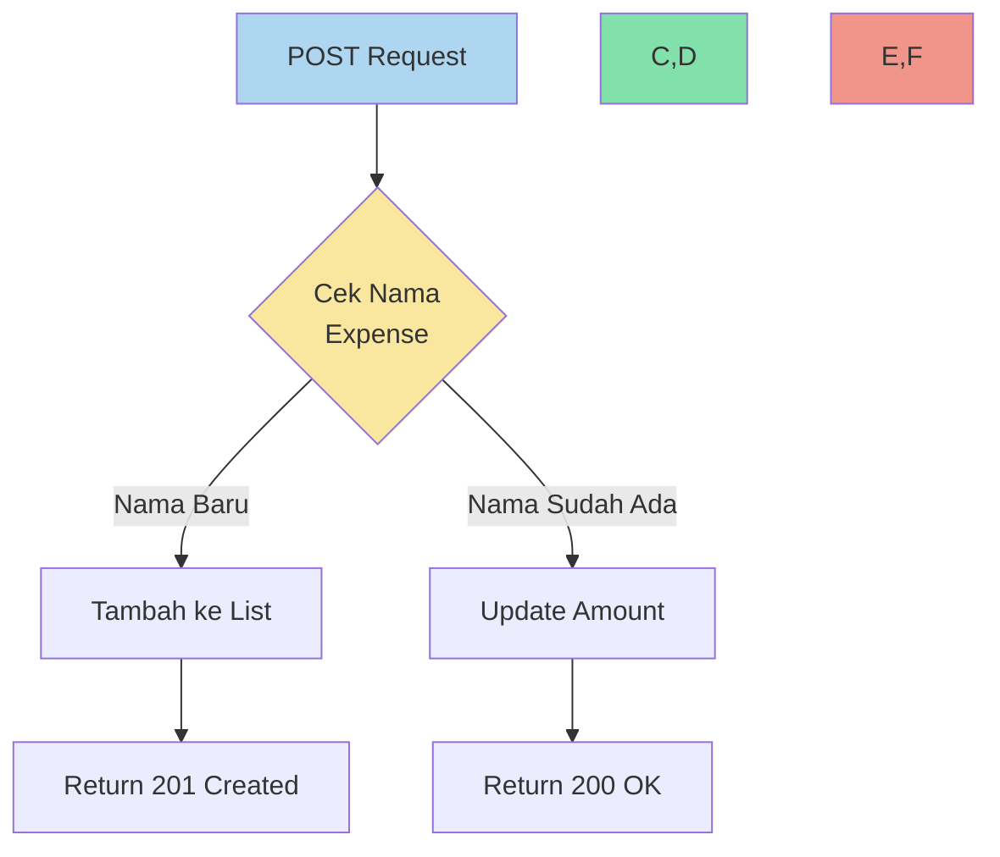
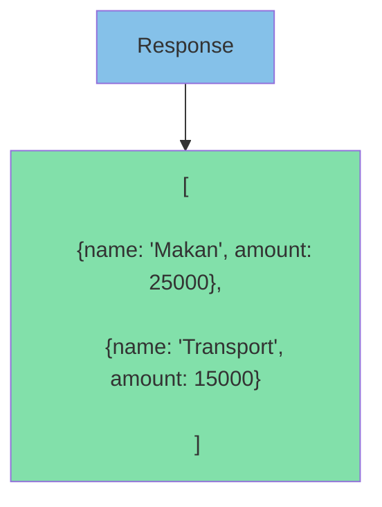
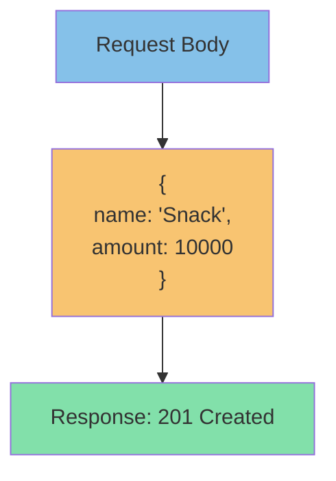
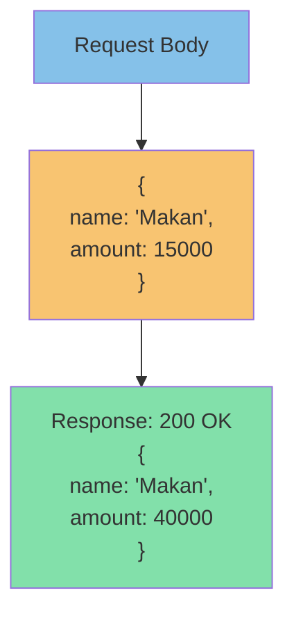

# 📸 Visualisasi API Expenses

## 1. Arsitektur API Sederhana

## 2. Alur Request GET

## 3. Alur Request POST

## 4. Contoh Response

### GET /expenses

### POST /expenses (Nama Baru)

### POST /expenses (Update)

## 💡 Penjelasan

1. **Simpan Data**:

   - Semua data disimpan di ArrayList
   - Data bersifat sementara (in-memory)

2. **GET Request**:

   - Client minta data
   - API ambil dari ArrayList
   - Return dalam format JSON

3. **POST Request**:

   - Client kirim data baru
   - API cek nama expense
   - Kalau baru = tambah
   - Kalau ada = update jumlah

4. **Response Status**:
   - 201: Berhasil tambah baru
   - 200: Berhasil update
   - Format selalu JSON
